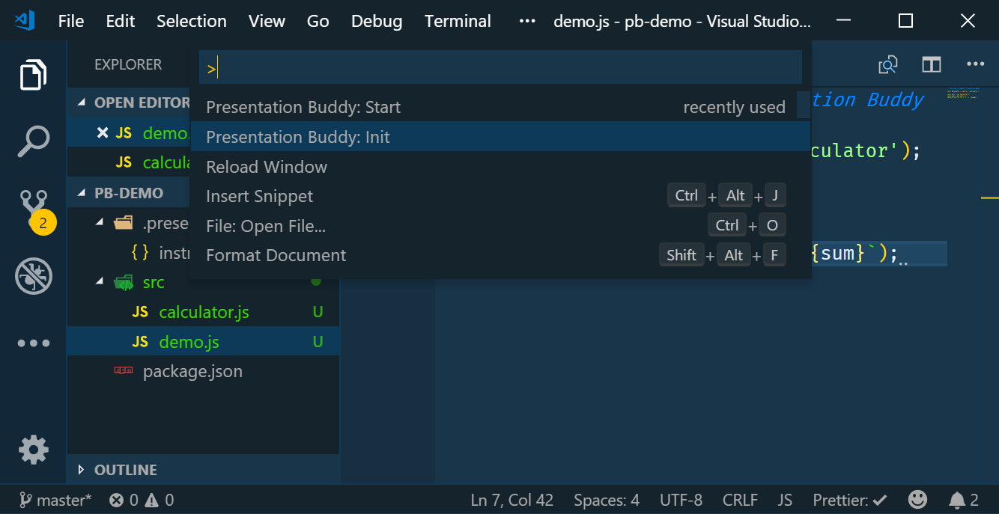

# Presentation Buddy


## Features

Automatically type code during presentations

### Initializing with Presentation Buddy: Init

Initialize Presentation Buddy to create the required `.presentation-buddy\instructions.json` file with some demo instructions.
You can do this using the Command Palette (Ctrl+Shift+P) and selecting the `Presentation Buddy: Init` command.



### Starting with Presentation Buddy: Start

Once Presentation Buddy is initialized and you have updated the instructions you can start Presentation Buddy using the Command Palette (Ctrl+Shift+P) and selecting the `Presentation Buddy: Start` command.


## Extension Settings

This extension contributes the following settings:

- `presentation-buddy.delay`: Delay (in ms) between keys entered. Defaults to 100ms.
- `presentation-buddy.randomness`: Randomness (in ms) between keys entered. Defaults to 25ms.
- `presentation-buddy.waitInsteadOfTyping`: Default array of strings which indicate a pause when typing chunks from a file. 
- `presentation-buddy.waitAfterTyping`: Default array of strings which indicate a pause when typing chunks from a file.
- `presentation-buddy.skipLinesContaining`: Default array of strings indicating lines to skip when typing chunks from a file.
- `presentation-buddy.waitAfterNewLine`: controls whether to pause after each new line when typing chunks from a file.

## Instructions

Note: Any instruction will accept a `"skip": true` settings causing it to be ignored

### TypeText

Type some text at the current cursor position of the currently open file. The text setting can either be a string or an array of strings. In the case of an array of strings each string is entered on a new line.

This takes an optional numerical `delay` setting in ms which can be used to override the default delay between keys. This can be useful if you want to speed up or slow down the typing speed for a specific instruction.

Example:

```JSON
{
  "type": "typeText",
  "text": [
    "// Some comment",
    "const lineTwo = true;"
  ]
}
```

### TypeTextFromFile

Type some text at the current cursor position of the currently open file. The text is read from the file indicated by the path. The path is relative to the `.presentation-buddy` folder.

This takes an optional numerical `delay` setting which can be used to override the default delay between keys. This can be useful if you want to slow down the typing speed for a specific instruction.

Example:

```JSON
{
  "type": "typeTextFromFile",
  "path": "./text-source.js"
}
```

### TypeChunksFromFile

Type text at the current cursor position of the currently open file. Text is read from the file indicated by the path, relative to the `.presentation-buddy` folder. The input file will be split into chunks based on the supplied settings. 

By default, the input will be split on newlines (`\n`). To disable this, set `waitAfterNewLines` to `false`.

Windows-style `\r\n` line endings will be converted to `\n` before the file is processed.

Presentation Buddy will:

* `wait` after typing any string matching a supplied `waitAfter` argument
* `wait` **instead of** typing any string matching a supplied `waitInsteadOf` argument
* Skip any line containing any string matching a supplied `skipLinesContaining` argument.

#### Example:

This will type the contents of `chunks-exampe.js` into the current window, one line at a time.

Any line containing the comment `//skip` will be skipped. Presentation Buddy will pause after typing an opening curly bracket `{`, a dot `.`, a lambda function symbol `  =>  `, or an assignment `  =  `. If the input contains the string `/*WAIT*/`, this will pause Presentation Buddy but the `/*WAIT*/` won't be copied to the output.

```json
{
  "type":"typeChunksFromFile",
  "path": "chunks-example.js",
  "waitAfterTyping": [ "{", ".", " => ", " = " ],
  "waitInsteadOfTyping": [ "/*WAIT*/" ],
  "skipLinesContaining": [ "//skip" ]
}
```

The input file `chunks-example.js`:

```js
import { Color } from './color.js'; //skip 
//skip
export class Scene {
    constructor(camera, background, shapes) {
        this.camera = camera;
        this.background = background /*WAIT*/ ?? Color.Black;
        this.shapes = shapes ?? [];
    }
    trace = (x, y) => this.camera.trace(this, x, y);
}
```

### OpenFile

Opens the file specified in the editor. Note that the file needs to exist.

See also: CreateFile

Example:

```JSON
{
  "type": "openFile",
  "path": "src/my-file.js"
}
```

### GoTo

Go to a specific position in the currently open file. The positions are 1 based so they match up with what Visual Studio Code displays. Both the line and column default to 1 if not specified.

Example:

```JSON
{
  "type": "goto",
  "line": 75,
  "column": 21
}
```

### Select

Select from the current position to a specific position in the currently open file. The positions are 1 based so they match up with what Visual Studio Code displays. Both the line and column default to 1 if not specified.

Example:

```JSON
{
  "type": "select",
  "line": 75,
  "column": 21
}
```

### Command

Executes one of the standard Visual Studio Code commands. The command should be one of the standard Visual Studio Code command names. See the Keyboard shortcuts for the known commands. When the command requires additional parameters an **args** array or primitive types can be passed along. Add an optional `repeat` settings if a command needs to be executed multiple times.

Note: Not all commands might work as expected so your mileage may vary.

Examples:

```JSON
{
  "type": "command",
  "command": "workbench.action.files.save"
},
{
  "type": "command",
  "command": "editor.action.smartSelect.expand",
  "repeat": 2
},
{
  "type": "command",
  "command": "editor.action.clipboardPasteAction"
}
```

### CreateFile

Creates the file specified and opens it in the editor.

Note: If the file specified already exists it is replaced with an empty file.

Example:

```JSON
{
  "type": "createFile",
  "path": "src/my-file.js"
}
```

### Wait

Pauses playback for a pecified period. A delay can be passed as either a number representing the number of milliseconds to wait or and the `"manual"`. In the case of `"manual"` playback will only resume when the `Presentation Buddy: Continue` command is executed. If the `save` option is set to true all dirty editor files in the workbench will be saved first.

Examples:

```JSON
{
  "type": "wait",
  "delay": 10000
},
{
  "type": "wait",
  "delay": "manual",
  "save": true
}
```

## Example instructions

See `.presentation-buddy\instructions.json`

```json
[
  {
    "type": "createFile",
    "path": "src/calculator.js"
  },
  {
    "type": "typeText",
    "text": [
      "// This code is typed by Presentation Buddy",
      "",
      "class Calculator {",
      "  add(x, y) {",
      "    return x + y;",
      "  }",
      "}"
    ],
    "delay": 200
  },
  {
    "type": "goto",
    "line": 4,
    "column": 1
  },
  {
    "type": "command",
    "command": "workbench.action.files.save"
  },
  {
    "type": "command",
    "command": "workbench.action.closeActiveEditor"
  },
  {
    "type": "createFile",
    "path": "src/demo.js"
  },
  {
    "type": "typeText",
    "text": [
      "// This code is typed by Presentation Buddy",
      "",
      "const Calculator = require('./calculator');",
      "",
      "const calc = new Calculator();",
      "const sum = calc.add(1, 2)",
      "console.log(`The sum of 1 + 2 = ${sum}`);"
    ]
  },
  {
    "type": "openFile",
    "path": "src/calculator.js"
  },
  {
    "type": "command",
    "command": "cursorBottom"
  },
  {
    "type": "typeText",
    "text": ["", "module.exports = Calculator;"]
  }
]
```

## Known Issues

This is still in the experimental preview stage. Use at your own risk.
